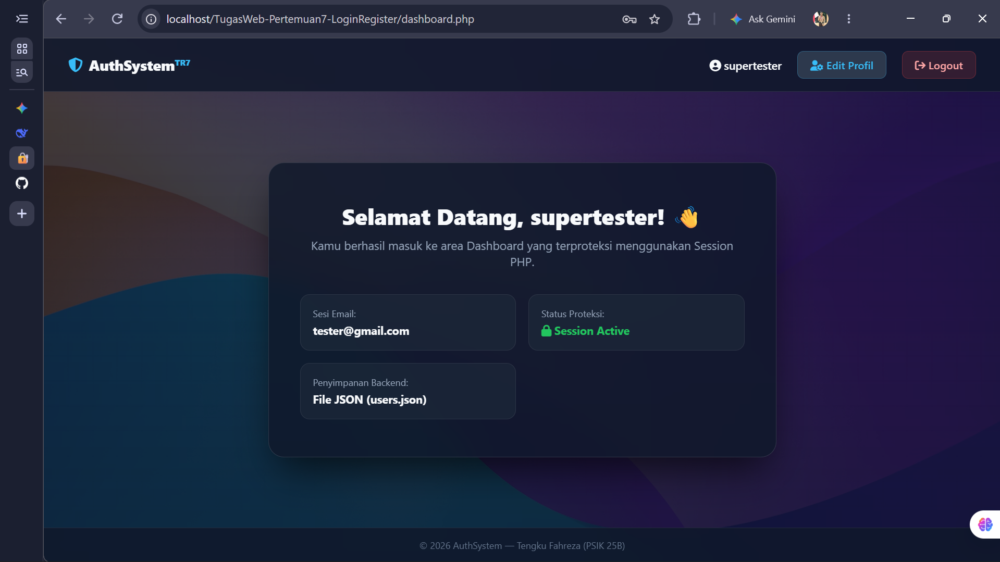

# Tugas Web Pertemuan 7 - Native PHP Authentication System (JSON Storage)

Proyek ini merupakan sistem autentikasi pengguna (**Login & Register**) berbasis **PHP Native** tanpa database SQL, menggunakan berkas **`users.json`** sebagai media penyimpanan data persisten. Antarmuka dikembangkan dengan pendekatan **Dark Glassmorphism** yang responsif dan terintegrasi dengan standar keamanan backend modern.

## 🔑 Akun Demo Pengujian

Untuk pengujian cepat tanpa registrasi ulang, dapat menggunakan kredensial bawaan pada `users.json`:
- **Email:** `tester@gmail.com`
- **Password:** `tester123`

## 📷 Tangkapan Layar Antarmuka

| Halaman Login | Halaman Registrasi |
| :---: | :---: |
|  |  |

| Halaman Dashboard | Halaman Edit Profil |
| :---: | :---: |
|  |  |

---

## 📌 Pemenuhan Kriteria Utama & Keamanan Backend

Proyek ini memenuhi seluruh kriteria wajib dan fitur bonus pada rubrik penilaian Tugas Rutin 7:

1. **Validasi & Sanitasi Input (XSS Protection):**
   Seluruh masukan formulir disanitasi menggunakan `htmlspecialchars()` untuk mencegah serangan *Cross-Site Scripting* (XSS) serta divalidasi menggunakan `filter_var()` untuk format email.

2. **Enkripsi Password (Bcrypt Hash):**
   Password pengguna dienkripsi secara aman menggunakan `password_hash()` (standar BCRYPT) sebelum disimpan ke `users.json`. Tidak ada password yang tersimpan dalam bentuk teks mentah (*plain text*).

3. **Pengecekan Duplikasi Email:**
   Sistem secara otomatis memeriksa ketersediaan email saat registrasi akun baru untuk mencegah pendaftaran ganda.

4. **Manajemen Sesi & Proteksi Halaman:**
   Menggunakan `session_start()` untuk mengelola sesi login. Halaman `dashboard.php` terproteksi penuh; akses tanpa sesi aktif akan otomatis di-redirect ke `login.php`.

5. **Logout & Session Destruction:**
   Fitur logout (`logout.php`) menghancurkan seluruh data sesi via `session_destroy()` dan membersihkan cookie autentikasi.

6. **Fitur Bonus (Remember Me, Edit Profile & UI Polish):**
   - **Remember Me:** Menggunakan *Secure Cookie* berdurasi 7 hari.
   - **Edit Profile:** Pengguna terautentikasi dapat memperbarui nama dan password mereka.
   - **UI Glassmorphism & Custom Favicon:** Antarmuka bertema keamanan cyber dengan logo tab browser khusus (`🔐`).

---

## 🛠️ Teknologi yang Digunakan

- **PHP Native (ES/8+)** — Session Management, JSON Read/Write, Password Hashing, dan Sanitasi Data.
- **JSON (`users.json`)** — File-based Data Storage.
- **HTML5 & CSS3** — Custom Dark Glassmorphism, CSS Grid/Flexbox, dan Animations.
- **Font Awesome 6 & Google Fonts (Inter)** — Ikonografi dan tipografi antarmuka.

---

## 👤 Informasi Mahasiswa

- **Nama:** Tengku Fahreza (4252550005)
- **Kelas:** PSIK 25B
- **Program Studi:** S1 Ilmu Komputer
- **Mata Kuliah:** Pemrograman Web
- **Instansi:** Universitas Negeri Medan (UNIMED)